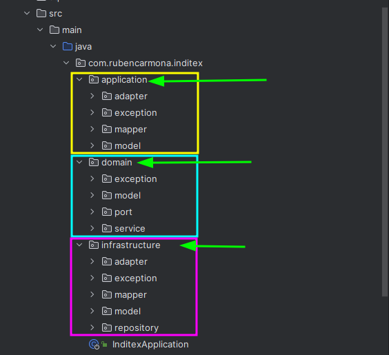

# Microservice E-Commerce

Autor:

- Rubén Carmona García
  Fecha: 2024-02-25
- https://www.linkedin.com/in/rubencarmona/

## Índice

* [Introducción](#Introducción)
* [Inicio de la aplicación en Intellij IDEA](#Inicio-de-la-aplicación-en-Intellij-IDEA)
* [Esquema de las clases y los paquetes](#Esquema-de-las-clases-y-los-paquetes)
* [Esquema de carpetas](#Esquema-de-carpetas)
* [Tecnologías usadas](#Tecnologías-usadas)
* [Carpeta Resources](#Carpeta-Resources)
* [Swagger](#Swagger)
* [Error 404 Personalizado](#Error-404-Personalizado)
* [Campos de la Llamada](#Campos-de-la-Llamada)
* [Objeto de Respuesta](#Objeto-de-Respuesta)
* [Utilidades](#Utilidades)
* [Comandos de maven útiles](#Comandos-de-maven-útiles)

## Introducción

Microservicio que simula el funcionamiento de un comercio electrónico.
Obtenemos en una llamada el precio de un producto determinado para aplicar en una fecha expecífica, si existe.
Teniendo en cuanta la prioridad del precio y la fecha introducida.

Se ha utilizado una estructura hexagonal junto con un enfoque de diseño basado en el dominio, al cual le daremos toda la
importancia.

## Esquema de las clases y los paquetes

- Flechas Azules: Uso de las clases.

- Flechas Roja: Implementación de las interfaces.

- Flechas Verdes: Extensión de las clases.

## Esquema de carpetas

## Tecnologías usadas

- Java 17
- SpringBoot 3.2.2
- SpringWeb 5.16.0
- Lombok 1.18.30
- Swagger 3.0.0
- Git 2.41.0
- Maven 3.9.5

Como IDE IntelliJ IDEA 2023.3.4

## Resources

Dentro de esta carpeta se han incluido el script sql inicial y la colección de postman para importar.
La colección incluye todos sus test.

Podemos iniciar la aplicación y probar con Postman o probar las llamadas un vez iniciciada la aplicación con el propio
swagger.

## Swagger

Mediante la interfaz web de Swagger se podrá probar y lanzar llamadas al endpoint una vez inciciada la aplicación.

- http://localhost:8080/swagger-ui.html

## Error 404 Personalizado

Se ha personalizado un objeto en la respuesta para los errores 404.
Usando un GlobalControllerAdvice en la capa de aplicación.

## Campos de la Llamada

| Campos            | Información                                                 |
|-------------------|-------------------------------------------------------------|
| `applicationDate` | Fecha en la que necesitamos saber el precio, LocalDateTime. |
| `brandId`         | Id, Cadena del grupo, Integer.                              |
| `productId `      | Id del producto a buscar el precio, Integer.                |

## Objeto de Respuesta

## Inicio de la aplicación en Intellij IDEA

Abrá IntelliJ IDEA y haga clic en “Open or Import” para importar el proyecto desde GitHub.

https://github.com/R-Carmona/e-commerce.git

Selecciona la opción “Open as Project” y seleccione el directorio raíz del proyecto.

Una vez que se haya cargado el proyecto, vaya a la pestaña “Maven Projects” en el lado derecho de la pantalla.

Expanda el proyecto y haga clic derecho en la carpeta “Lifecycle”.

Elija “install” de la lista de opciones. Esto creará una carpeta “target” que contiene el código construido.

Una vez que la construcción esté completa, vaya al menú “Run” y elija “Edit Configurations”.

En el menú izquierdo, elija “Maven”.

En el campo “Command line”, ingrese “spring-boot:run” – esto iniciará la aplicación Spring Boot.

Haga clic en “OK” para guardar la configuración.

Haz clic en “Run” para iniciar la aplicación.

Más información:
https://www.jetbrains.com/help/idea/run-debug-configuration-spring-boot.html

## Utilidades

### Comandos de maven útiles

- $ mvn compile – compila el proyecto y deja el resultado en target/classes
- $ mvn test – compila los test y los ejecuta
- $ mvn install – guarda el proyecto en el repositorio
- $ mvn clean – borra el directorio de salida (target)

Empaquetado de la aplicación.

- $ mvn package – empaqueta el proyecto y lo dejará en target/inditex-0.0.1-SNAPSHOT.jar

